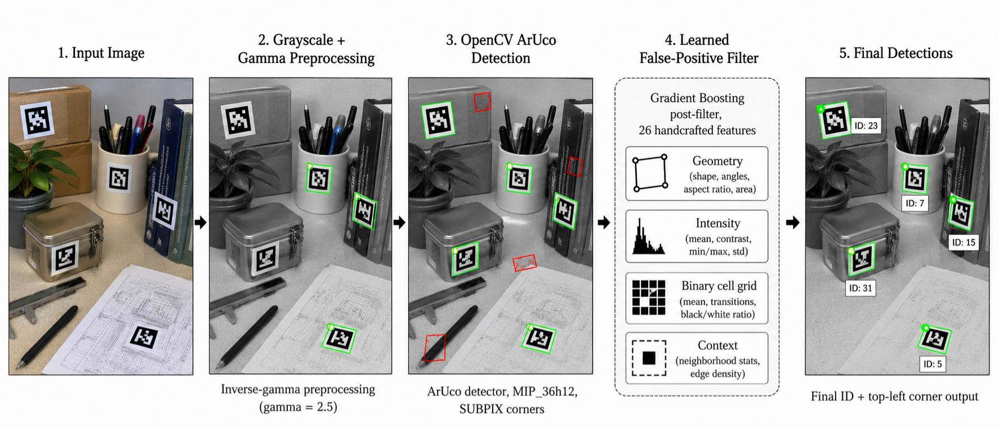

# ArUco Marker Detection

Computer vision pipeline for detecting ArUco fiducial markers in the FlyingArUco challenge dataset. The final system combines OpenCV's ArUco detector, gamma preprocessing, and a lightweight machine-learning filter for false-positive removal.



## Highlights

- OpenCV `DICT_ARUCO_MIP_36h12` detector with sub-pixel corner refinement.
- Empirical preprocessing study across CLAHE, sharpening, contrast stretching, histogram equalization, bilateral filtering, and gamma correction.
- Final preprocessing uses inverse-gamma correction with `gamma=2.5`.
- Gradient Boosting post-filter trained on 26 geometry, intensity, binary-pattern, and context features.
- Kaggle test score: `0.940` compared with `0.783` for the OpenCV baseline.

## Project Report

For a paper-style explanation of the method, ablation study, and error analysis, see [Paper.pdf](reports/Paper.pdf).

## Project Structure

```text
.
+-- aruco_marker_detection/   # Reusable pipeline modules
+-- scripts/                  # Main commands for inference/training
+-- experiments/              # Ablation and tuning experiments
+-- reports/                  # Experiment notes and project report
+-- models/                   # Trained lightweight ML model
+-- outputs/                  # Generated submissions and visualizations
```

The dataset folder `aruco-detection-challenge/` is intentionally ignored by Git. Place the competition data there before running the pipeline.

## Setup

```bash
pip install -r requirements.txt
```

For the optional CNN recovery experiment:

```bash
pip install torch torchvision
```

## Usage

Evaluate the final pipeline on the training split:

```bash
python scripts/run_pipeline.py --mode eval
```

Generate a Kaggle submission:

```bash
python scripts/run_pipeline.py --mode submit
```

Retrain the ML false-positive filter:

```bash
python scripts/train_ml_filter.py
```

Run preprocessing ablations:

```bash
python experiments/test_preprocess.py
```

## Method Summary

The baseline detector already over-detects: it finds more candidates than there are ground-truth markers, so the main bottleneck is false positives rather than raw recall. Because the challenge metric penalizes spam detections in the denominator, the final design favors conservative filtering over multi-pass merging.

The best preprocessing method is power-law gamma correction. In this implementation, `gamma > 1` applies an inverse-gamma exponent and lifts mid-tone intensities, improving marker/background separation for the dataset. Multi-pass detection, relaxed error correction, CLAHE merges, and CNN recovery were tested but rejected because they increased false positives faster than they recovered missed markers.

## Results

| Pipeline | Train score | Test score | Notes |
| --- | ---: | ---: | --- |
| OpenCV baseline | 0.780 | 0.783 | Default detector with SUBPIX refinement |
| Gamma preprocessing + heuristic filter | 0.890 | - | Strong false-positive reduction |
| Final + ML filter | 0.952 | 0.940 | Best submitted pipeline |

See [Paper.pdf](reports/Paper.pdf) for the polished report and `reports/experiment_report.md` for the experiment log and failed-approach analysis.
